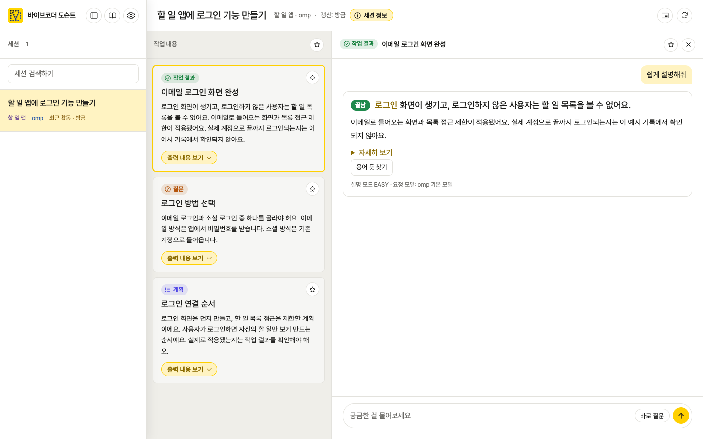
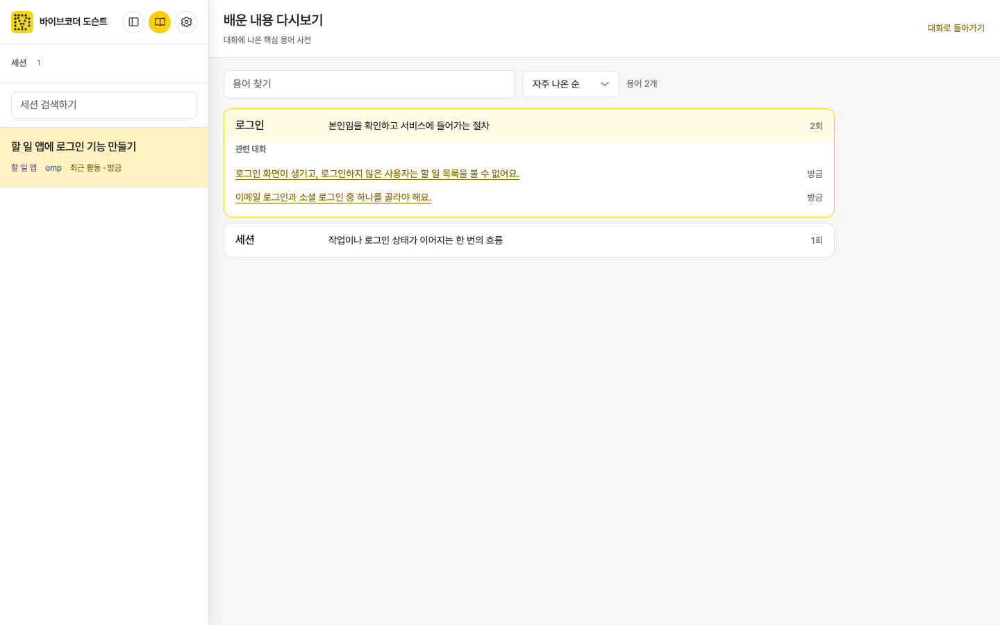

# 바이브코더 도슨트 (Vibecoder Docent)

**바이브코더**(코드를 직접 읽지 않고 AI 에이전트에게 일을 시키는 사람)를 위한 **도슨트**(작품을 만지지 않고 설명하는 안내자). 작업 기록을 읽고 AI의 질문, 결과, 계획을 쉬운 한국어로 풀어 주는 로컬 웹앱이다. 코드를 수정하거나 실행하지 않는다.

Vibecoder Docent explains coding-agent sessions in plain Korean without changing code. It shows important questions, results, and plans, then lets you ask about each item. Your session files stay on your computers; the app runs locally and uses your installed omp to answer.

[화면 안내](#화면-안내) · [설치](#설치) · [다른 컴퓨터](#다른-컴퓨터의-세션-보기) · [데이터와 개인정보](#데이터와-개인정보) · [개발](#개발)

## 무엇을 하나



세션에서 AI의 질문·작업 결과·계획만 골라 보여 준다. 궁금한 카드를 누르면 그 내용에 관한 대화가 열리고, “왜 이렇게 했어?”, “이 선택지는 뭐야?”처럼 이어 물을 수 있다. 확인된 원문은 별도로 열어 볼 수 있다. 화면 예시는 **가짜 작업 기록**으로 만들었으며 실제 사용자 세션을 담지 않는다.

## 요구 사항

- Node.js 22 이상
- [omp](https://omp.sh) 설치 및 로그인. 도슨트가 로컬 omp를 호출해 학습 맥락을 분류하고 설명을 만든다.
- Claude Code·Codex CLI·Gemini CLI·pi 세션은 선택 사항이다. 읽을 수 있는 세션이 있으면 omp 세션과 함께 목록에 나온다. 설명하는 모델은 omp에 로그인한 공급자(Anthropic, OpenAI Codex, GLM(zai) 등) 중에서 설정에서 고른다.
- 새 질문·결과·계획의 자동 선별은 선택 사항인 `TYPESAFE_API_KEY`가 있을 때 Jev를 사용한다. 키가 없으면 구조화된 질문만 라이브 카드로 보여 주며, 수동 질문은 계속 사용할 수 있다.

## 설치

공개 GitHub Release에 첨부된 패키지를 설치한다.

```sh
npm install -g https://github.com/foxion37/videcoder-docent/releases/latest/download/videcoder-docent.tgz
```

## 실행

```sh
docent
```

기본 주소는 `http://127.0.0.1:4747`이다. 이미 켜져 있으면 새 서버를 띄우지 않고 브라우저만 연다. 종료하려면 실행한 터미널에서 중단한다.

| 옵션 | 용도 |
| --- | --- |
| `--no-open` | 브라우저를 자동으로 열지 않는다. |
| `--port N` | 웹앱의 포트를 지정한다. |
| `--host tailscale` | 로컬 주소에 더해 이 컴퓨터의 Tailscale 주소에도 연다. |
| `--peer 이름=URL` | 다른 컴퓨터의 도슨트 세션을 목록에 추가한다. 반복 지정 가능하다. |
| `--version`, `--help` | 버전 또는 사용법을 표시한다. |

## 화면 안내

| 영역 | 하는 일 |
| --- | --- |
| 세션 | omp·Claude Code·Codex CLI·Gemini CLI·pi의 작업 세션을 고른다. 검색하거나 최근 10개 다음 목록을 더 볼 수 있다. 오른쪽 경계를 끌어 너비를 바꿀 수 있다. |
| 작업 내용 | AI의 질문·결과·계획을 최신 순서로 보여 준다. 준비된 설명의 제목·요약을 보고 카드를 누른다. 오른쪽 경계를 끌어 너비를 바꿀 수 있다. |
| 카드별 대화 | 선택한 카드에 관해 이어 묻는다. 대화의 첫 메시지로 그 카드의 AI 출력 내용이 모두 보인다. 앞 문답을 기억하는 이어지는 대화이고, 질문이 다른 카드를 가리키면 그 카드 대화로 옮기기를 제안한다. 카드와 무관한 질문은 **세션 전체 대화**에 남긴다. 답은 나오는 대로 보이고, 결론부터 보여 주며 자세한 설명은 접어 둔다. |
| 입력창 | **Enter**는 보내기, **Shift+Enter**는 줄바꿈. 줄 맨 앞 `- `는 불릿, `1. `은 번호 문단이 되고 Shift+Enter로 다음 항목을 이어 쓴다. |
| 설명 중 조작 | **Esc**나 멈춤 버튼은 설명을 멈추고 보낸 문장을 입력창에 돌려준다. **Enter**는 다음 질문으로 대기시키고(고치기·지우기 가능), **⌘Enter**나 **지금 바로잡기**는 쓰던 설명을 멈추고 보정해 다시 설명한다. |
| 바로 질문 | 설명 방식을 고르면 입력창에 질문이 채워진다. 전송은 직접 눌러야 하며, 10초 설명은 생성 시간이 아닌 *읽는 분량*을 뜻한다. |
| 즐겨찾기 | 카드나 대화의 별을 눌러 저장하고 작업 내용에서 즐겨찾기만 볼 수 있다. |
| 배운 내용 다시보기 | 문답에서 모은 핵심 단어의 한 줄 뜻과 관련 대화를 검색·정렬한다. 옛 문답은 원할 때 **용어 정리**를 누른다. |
| 설정 | 프로필별 도슨트 모델, 기본·영역별 설명 모드, 미리 설명, 다른 기기에서 열기(Tailscale 공유), 밝음·어둠·자동 테마를 고른다. |



새 중요 사건의 쉬운 설명은 기본적으로 미리 준비하지만, 프로필에서 끈 설정은 유지한다. 세션을 한 번 열면 docent가 12시간 동안 그 세션을 지켜보며 탭을 닫아도 준비한다. 프로필마다 한 번에 하나씩, 10분에 최대 5개이며, 직접 한 질문이 먼저다. 모델 호출에 시간과 비용이 들며 이전 사건은 미리 설명하지 않는다. 선택한 도슨트 모델은 *새 설명 요청*에만 적용되고, 원래 작업 세션의 모델을 바꾸지 않는다. docent가 부르는 omp는 사용자의 기억·확장 설정을 쓰지 않는다. 표시된 입력·출력 단가는 omp 카탈로그의 참고값이지 실제 청구액이 아니다.

**원문 보기**는 답이 인용한 기록을 확인할 수 있을 때만 열린다. 원격 컴퓨터가 꺼졌거나 원문이 바뀌었다면 당시 저장한 발췌임을 구분해 보여 준다. 도슨트는 알 수 없는 이유를 사실처럼 말하지 않아야 하고, 담당 에이전트에게 보낼 요청 문장은 사용자가 원할 때만 만든다.

**작은 창(PiP)**은 본문 화면의 미니 버전이다. 위쪽에는 작업 내용 카드 목록, 아래쪽에는 선택한 카드의 대화와 입력창이 있으며, 창을 넓히면 각각 왼쪽과 오른쪽에 놓인다. 작업 내용과 대화의 비중은 약 35:65다. 카드를 누르면 그 카드의 대화가 열리고 작은 창에서 보낸 질문도 본문과 같은 대화에 남는다. 별도 라이브 연결이나 모델 호출은 만들지 않는다. 원문 보기와 배운 내용 다시보기는 본문 창에서 연다. 데스크톱 Chromium의 Document Picture-in-Picture와 localhost 같은 보안 컨텍스트가 필요하며, 본문 탭을 닫으면 작은 창도 닫힌다.

## 다른 컴퓨터의 세션 보기

양쪽 컴퓨터에서 도슨트를 실행하고 [Tailscale](https://tailscale.com) 사설망으로 연결한다. 세션을 보여 주는 컴퓨터:

```sh
docent --host tailscale
```

내 컴퓨터에서 그 주소를 등록한다:

```sh
docent --peer laptop=http://my-laptop:4747
```

매번 옵션을 쓰지 않으려면 내 컴퓨터의 `~/.docent/config.json`에 설정한다:

```json
{"peers":{"laptop":"http://my-laptop:4747"}}
```

보여 주는 컴퓨터에는 `{"host":"tailscale"}`로 설정할 수도 있다. 웹앱 설정창의 **다른 기기에서 열기**를 켜면 서버를 다시 시작하지 않고도 같은 대기를 열고 닫을 수 있고, 켜고 끈 상태는 config.json의 `tailscale`에 저장된다. 원격 세션의 전사와 라이브를 읽고 **내 컴퓨터의 omp**로 답을 만든다. 원격 문답 기록은 프로필이 같은 사람인지 확인할 수 없어 자동으로 합치지 않는다. 양쪽 도슨트 버전을 맞추는 편이 안전하다.

## 데이터와 개인정보

- 원본 세션은 해당 컴퓨터의 `~/.omp`·`~/.claude`에서 읽는다. 새 문답·학습 기억·즐겨찾기는 기본적으로 내 컴퓨터의 `~/.docent/learning.json`에 저장한다. 이전 `questions.jsonl`은 기본 프로필의 과거 문답으로 읽기만 한다. 프로필은 로그인이 아니다.
- 앱은 기본적으로 `127.0.0.1`에만 열린다. **인증이 없으므로** `--host tailscale`은 신뢰하는 사설망에서만 사용하고 Tailscale Funnel 등으로 공개하지 않는다. 원격 세션을 보면 전사 내용이 두 컴퓨터 사이로 전달된다.
- `DOCENT_HOME`으로 도슨트 데이터 폴더를 바꿀 수 있다. `DOCENT_PORT`, `DOCENT_HOST`, `DOCENT_PEERS`로 포트·호스트·동료 설정을 지정할 수 있고, `OMP_BIN`으로 omp 실행 파일을 지정할 수 있다. `TYPESAFE_API_KEY`는 Jev 판정을 위한 선택적 환경변수다. 비밀값은 설정 파일에 쓰지 않는다.
- 같은 데이터 폴더를 여러 서버에서 동시에 수정하지 않는다. 이 앱의 프로필 선택은 접근 제어가 아니며, 외부에 열기 위한 인증 기능도 없다.

자세한 보안 모델과 취약점 제보 방법은 [SECURITY.md](SECURITY.md)를 참고한다.

## 개발

```sh
npm ci
npm run build
npm start
node --test tests/*.test.mjs
```

빌드는 React·Streamdown 표시 자산을 로컬에 만든다. 배포 패키지에도 자산이 포함되어 실행 중 CDN이 필요하지 않다. 코어 설명 규칙은 [prompt/docent.md](prompt/docent.md), 설계는 [docs/architecture.md](docs/architecture.md), 결정 과정은 [docs/decisions/](docs/decisions/)에 있다. 기여 방법은 [CONTRIBUTING.md](CONTRIBUTING.md)를 참고한다.

## 라이선스

코드는 [MIT](LICENSE) (`Copyright (c) 2026 foxion37`). 포함된 Pretendard 글꼴은 SIL Open Font License 1.1이며 [THIRD_PARTY_NOTICES.md](THIRD_PARTY_NOTICES.md)에 고지한다.
